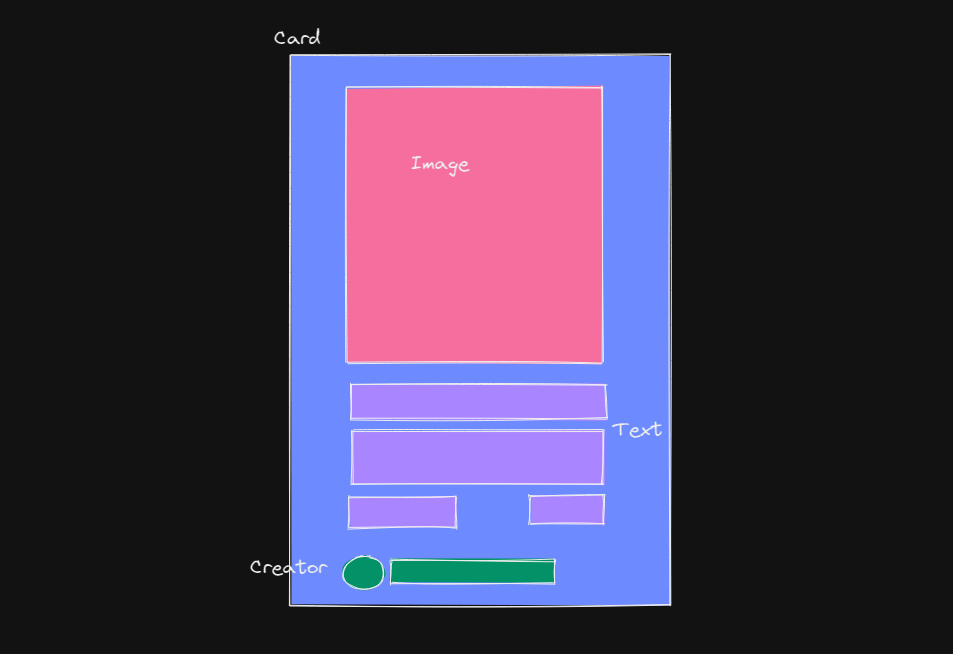
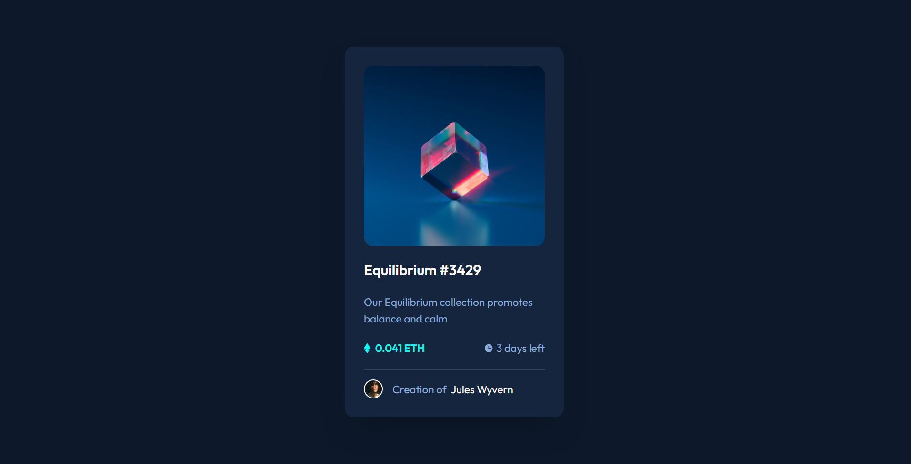

# Frontend Mentor - NFT preview card component solution

This is a solution to the [NFT preview card component challenge on Frontend Mentor](https://www.frontendmentor.io/challenges/nft-preview-card-component-SbdUL_w0U). Frontend Mentor challenges help you improve your coding skills by building realistic projects.

## Table of contents

- [Overview](#overview)
  - [The challenge](#the-challenge)
  - [Screenshot](#screenshot)
  - [Links](#links)
- [My process](#my-process)
  - [Built with](#built-with)
  - [What I learned](#what-i-learned)
- [Author](#author)
- [Acknowledgments](#acknowledgments)

## Overview

### The challenge

Users should be able to:

- View the optimal layout depending on their device's screen size
- See hover states for interactive elements

### Screenshot

Draft (Excalidraw)

Final

### Links

- Solution URL: [Github](https://github.com/0XCCY/FrontendMentor-nft-preview-card-component)
- Live Site URL: [Github Page](https://0xccy.github.io/FrontendMentor-nft-preview-card-component/)

## My process

### Built with

- [Create-React-App](https://reactjs.org/docs/create-a-new-react-app.html) - Toolchain
- [React](https://reactjs.org/) - JS library
- [Tailwind CSS](https://tailwindcss.com/) - For Styles
- [gh-pages](https://www.npmjs.com/package/gh-pages) - For GitHub Page deployment

### What I learned

Nothing much really. Excited for the next one!

## Author

- Frontend Mentor - [@yourusername](https://www.frontendmentor.io/profile/0XCCY)
- Twitter - [@0xCCY](https://www.twitter.com/0xCCY)

**Note: Delete this note and add/remove/edit lines above based on what links you'd like to share.**

## Acknowledgments

[Frontend Mentor](https://www.frontendmentor.io/home) - For making this awesome challenge!
